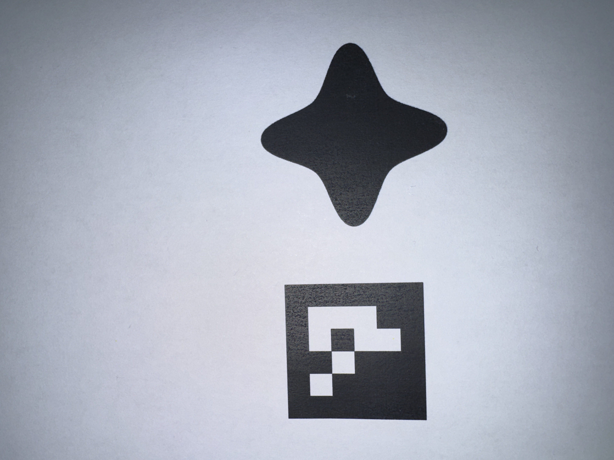
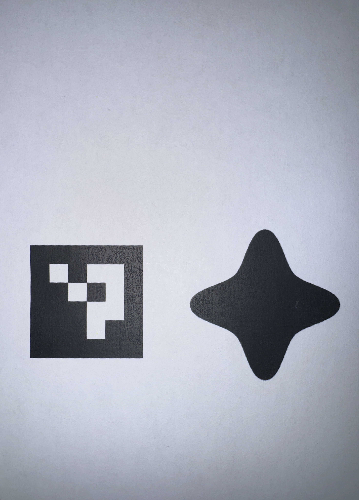
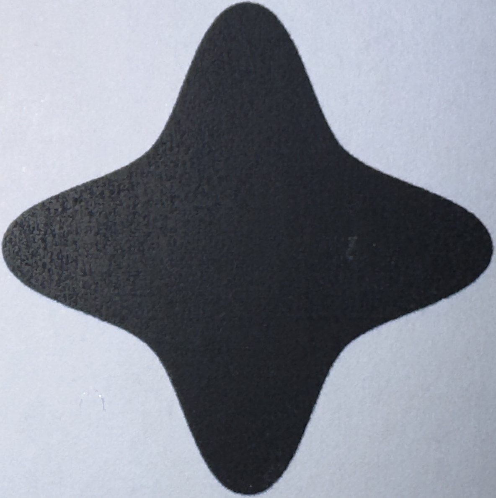
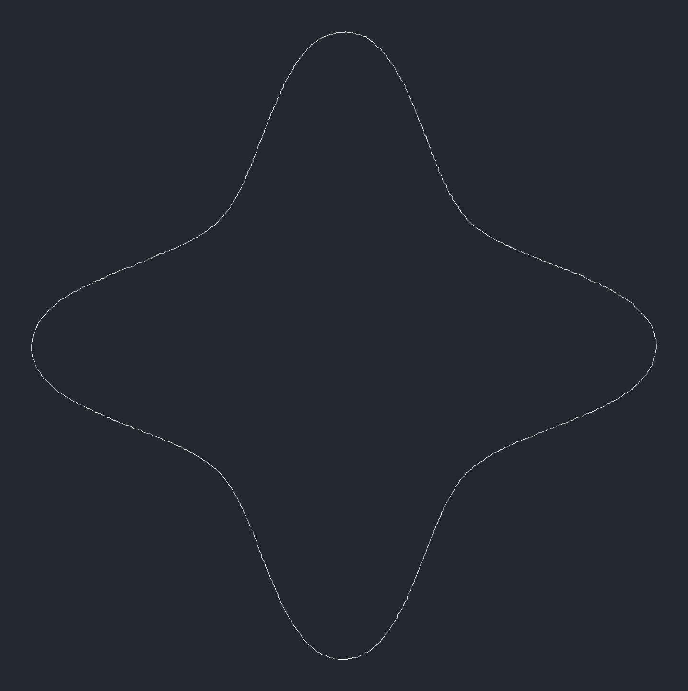

# image2plug

**image2plug** is a command-line utility that lets you turn a **photo of a hole in a wall (or other surface)** into a **DXF file** and an **OpenSCAD 3D extrusion**, ready for 3D printing or CNC cutting. The goal is to enable quick creation of physical patches ("plugs") from real-world images, using only a camera and a printer.

---

## 🎯 Project Goals

- ✅ Take an image of a hole, irregular cutout, or damaged area.
- ✅ Straighten the image (correct perspective/keystone).
- ✅ Detect a scale marker (e.g., a printed square or QR code).
- ✅ Extract the outline of the hole as a vector shape.
- ✅ Export the shape as:
  - 📐 DXF (for CAD/CAM use)
  - 🔩 OpenSCAD script (extruded to a solid)
- ✅ Allow users to fabricate a precise patch without manual tracing.

---

## 🔧 Typical Workflow (Single Marker)

Example using the `assets/example1/` image set:

| Step             | Command                                              | Output                                                |
|------------------|------------------------------------------------------|-------------------------------------------------------|
| **Original**     | (photo)                                              |            |
| **Straighten**   | `python straighten.py assets/example1/original.jpeg assets/example1/corrected.png` |            |
| **Detect**       | `python detect_candidates.py assets/example1/corrected.png results --threshold` |               |
| **Render**       | (optional preview)                                   |     |

---

### Recommended Capture Setup

For best results, capture your images with the following considerations in mind.

1. **Device:**  
   Use a smartphone or camera with a high-resolution sensor and RAW capture capability.  
   - Recommended: iPhone Pro models shooting in **ProRAW** for maximum detail and minimal processing artifacts.  
   - Other options: Android devices with RAW (DNG) support or compact cameras with macro modes.

2. **Lens:**  
   Select a lens with minimal distortion and close focusing ability.  
   - Recommended: Telephoto (e.g. 77 mm equivalent) or macro lenses to fill the frame with minimal distortion.  
   - Avoid: Ultra-wide lenses (e.g. 13–26 mm equivalent) unless properly corrected in post.

3. **Lighting:**  
   Ensure the subject is evenly lit, especially around the hole edges and marker.  
   - Recommended: Onboard flash (iPhone's flash syncs with ProRAW), or an external diffused LED panel to remove shadows and highlight fine details.  
   - Avoid: Overhead lighting that casts strong shadows from the lens itself.

4. **Marker:**  
   Print a single **30 × 30 mm ArUco marker** at 100 % scale.  
   - Place the marker **close to the hole**, ideally on the same surface plane.  
   - Ensure the marker is not distorted or curled.  
   - By default, the tool expects a `DICT_4X4_50` ArUco marker with ID `0`, generated using the provided script.

---

Alternatively, you can run the entire process in one step using the `workflow.py` script:

```bash
python workflow.py assets/example1/original.jpeg results --proof
```

This runs straighten, detection, and outputs a proofing report (`results/proof_report.html`) along with all intermediate and final files.

## 🔍 Components & Tools Used

- **OpenCV:** For image straightening, edge detection, and contour finding.
- **ezdxf:** For creating the DXF files.
- **solidpython (or pure text):** For generating OpenSCAD scripts.
- **Optional:** `pyzbar`, `opencv-aruco`, or other libraries to detect scaling markers.

---

## ⚙️ Future Plans

- Automatic marker detection with ArUco tags.
- Export directly to STL.
- Web or GUI interface.
- Auto-cleanup of rough contours.
- Multiple hole detection in one image.

---

## 📦 Installation

Clone the repository:

```bash
git clone https://github.com/mitchellcurrie/image2plug.git
cd image2plug
pip install -r requirements.txt
```

---

## 📏 ArUco Scale Marker

Generate a reference tag by running:

```bash
python scripts/generate_aruco_marker.py
```

This creates `assets/aruco_marker_30mm.png` using the `DICT_4X4_50` dictionary
with marker ID `0`. The output image is saved at 300 DPI so that it prints to
**30 mm × 30 mm** when printed at 100% scale. Place this marker in photos to
allow the tooling to automatically determine real-world scale.

---

## 🔑 License

This project is licensed under the MIT License, with an additional commercial attribution clause.

### Attribution Requirement for Commercial Use

Commercial usage is permitted free of charge, **provided attribution is visibly displayed to the user at runtime**. This includes, but is not limited to:
- CLI output
- API responses
- Automated job logs
- Web UI / terminal output

Example attribution:

```plaintext
Generated by image2plug (https://github.com/mitchellcurrie/image2plug)
```

See the LICENSE file for full details.

---

## Example Use Cases

- DIY wall or furniture repair.
- Industrial equipment cutouts.
- Model-making and prototyping.
- Archival restoration work.

---

## 🚀 Practical Usage

The primary workflow uses a single ArUco marker (e.g. 30 mm square) and a smartphone with a telephoto or macro lens and onboard flash. This minimizes distortion and shadows.

### Typical Parameters
```bash
# Straighten with default marker size 30 mm
python straighten.py input.jpg output.png

# Detect candidates with optional thresholding
python detect_candidates.py output.png meta.json cand_dir --threshold
```
